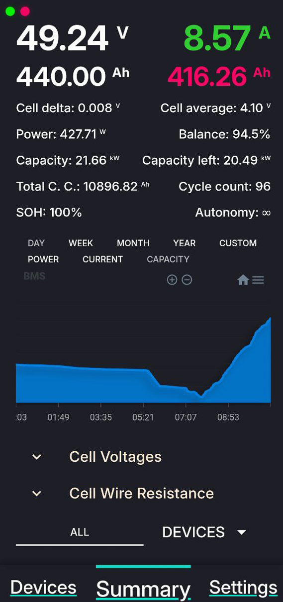
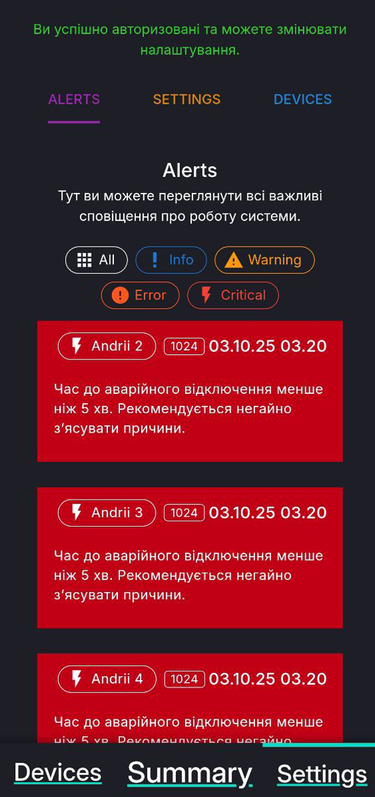

###        🔋 Devices overview   |   📊 System summary   |   ⚙️ Settings page

<p align="center">
  
  
  
</p>

## Supported devices
#### All JK-BMS models with software version >=6.0 are using the implemented protocol and should be supported.
* JK_BD6A20S6P, hw 17U, sw 17.02
* JK_BD6A17S6P, hw 11.XA, sw 11.48

#### All Deye models from this list are supported.
* SUN-6K-SG01/03/LP1-EU/AU

#### All TP-Link Tapo P110 Wi-Fi with software version >=1.2.1
* Tapo P100

# BMS Monitor [BLE]
## 🔋 Monitoring System for JK-BMS and Deye Inverter

This application provides full real-time monitoring of your energy system.  
It connects to:

- **JK-BMS** via Bluetooth low energy (using the `bleak` library)
- **Deye Inverter** via WiFi stick (using `pysolarmanv5`)

### 🧠 Key Features:
- Battery voltage, current, power, SOC, SOH
- Cell temperatures, internal resistance, cycle count, balancing
- Solar generation, home consumption, grid import/export

### ⚠️ WEB PUSH Notifications
Critical events (e.g. overheating, cell imbalance, low charge) are sent as push notifications to the PWA frontend.

### 📱 Progressive Web App (PWA)
The frontend is a PWA that works offline, supports mobile devices, and receives browser push notifications.

### 🚀 Why it's better:
- **No limitations of native apps** (e.g. Bluetooth only from a phone)
- **All data in one place** — accessible from any device
- **Runs autonomously on Raspberry Pi 5**, with no cloud dependency, 24/7

> Full control over your energy system — stable, local, and convenient.

## ⚠️ IMPORTANT: Before Using Deye Inverter and Tapo Sockets

To ensure stable system operation, you must **assign static IP addresses** to the inverter and Tapo sockets via your router settings. This prevents random IP changes after reboots and guarantees continuous connectivity.

## ✅ How to do this

1. Open your router’s admin panel in a browser:
   ```
   http://192.168.31.1
   ```

2. Navigate to the section:
   ```
   DHCP > Static Leases / Address Reservation / IP Binding
   ```

3. Add the **MAC address of the inverter's WiFi stick** and assign it a static IP address. Example:

   - **MAC:** `DC:4F:22:xx:xx:xx`
   - **IP:** `192.168.31.39`

4. Add your **Tapo smart plug** the same way:

   - **MAC:** `AC:84:C6:xx:xx:xx`
   - **IP:** `192.168.31.110`

5. Save the configuration.

6. Restart your **router** or **devices** to apply the changes.

---

🔁 **After this setup**, the IP addresses will no longer change and your system will maintain a stable connection with the inverter and smart plugs.

✅ This is highly recommended for all automation systems that depend on consistent local network addresses.

#### Deye
To connect to the inverter, you need to pass the following variables: INVERTER_IP, LOGGER_SN.

#### TP-Link Tapo
To connect to a Tapo outlet, you need to specify the outlet IP and EMAIL and PASSWORD from the official Tapo app.

### ⚙️ System Architecture

<code>
graph TD
  BMS[JK-BMS] --> PythonApp[Python Backend]
  Deye[Deye Inverter] --> PythonApp
  PythonApp --> DB[SQLite DB]
  PythonApp --> PWA[Frontend (PWA)]
  PythonApp --> Push[Web Push Notifications]
</code>
  
## First steeps:
### To access your application from outside the local network, you need to get a static IP address from your Internet provider.
### And etup Nginx and SSL ( https://github.com/RondaYummy/bms-monitor-ble/blob/main/docs/nginx.md )

### Make sure that the systemctl service is running:
```bash
sudo systemctl start bluetooth
sudo systemctl enable bluetooth
```

### Build Docker:
```bash
yarn build
```

### To copy static resources after a manual build:
```bash
yarn static
```

### [PROD] - [DEV] 
```bash
yarn prod
yarn dev
```

### [AUTO] Deploy via PM2

#### Preparing:
```bash
echo "$(whoami) ALL=(ALL) NOPASSWD: /sbin/reboot" | sudo tee /etc/sudoers.d/reboot-nopasswd
chmod +x deploy.sh
npm install pm2 -g
```

### [AUTO] Deploy start:
```bash
pm2 start ecosystem.config.js
```

### Clear Database [Example]
```bash
docker ps
docker exec -it bms-monitor-ble-python-app-1 bash
rm /app/data/*.db
exit
docker compose restart
```

## Motivation
The official app left me dissatisfied due to its lack of essential features. It doesn't provide critical notifications, such as alerts in Telegram for a low battery level, missing charging, or potential issues with the BMS itself. Monitoring these parameters while standing next to the BMS with my phone felt inefficient and inconvenient. I envisioned a solution where I could access all this data and functionality from anywhere in the world, without being tethered to a specific location.

Inspired by this need, I decided to create my own project using Python and develop a web application that integrates all these features in one place. Unlike the official app, my application includes real-time notifications, remote accessibility, and, importantly, data visualization through detailed charts—something the official app also lacks. This project is a step toward simplifying BMS monitoring and ensuring a seamless user experience, no matter where I am.

```markdown
## 🗺️ Roadmap / Features

- [x] JK-BMS monitoring via BLE
- [x] Deye Inverter monitoring via WiFi
- [x] TP-Link Tapo plug integration
- [x] PWA frontend with offline support
- [x] Web push notifications
- [x] Dockerized backend
- [ ] Telegram bot alerts
- [ ] Admin dashboard with charts
```

### Top contributors:
<a href="https://github.com/RondaYummy/bms-monitor-ble/graphs/contributors">
  
</a>

## 💬 Feedback & Support

Feel free to open an issue if you encounter any problems, or suggest new features here:  
👉 [GitHub Issues](https://github.com/RondaYummy/bms-monitor-ble/issues)

## References
- https://github.com/syssi/esphome-jk-bms - ESPHome component [RS485 BLE, rw] (C++, Python)
- https://github.com/PurpleAlien/jk-bms_grafana - Read data and graph in Grafana [RS485, ro] (Python)
- https://github.com/jblance/jkbms - Read data, used in jblance/mpp-solar [BLE, ro] (Python)
- https://github.com/sshoecraft/jktool - Linux utility [RS485 CAN BLE, ro] (C)
- https://github.com/maxx-ukoo/jk-bms2pylontech - Pylontech low voltage US2000 Bridge [RS485, ro] (C)
- https://github.com/ismarintan98/JK_BMS - Simple data monitor [RS485] (C++)
- https://github.com/Louisvdw/dbus-serialbattery/blob/master/etc/dbus-serialbattery/jkbms.py VenusOS drive [RS485, ro] (Python)
- https://secondlifestorage.com/index.php?threads/jk-b1a24s-jk-b2a24s-active-balancer.9591/ - JK-B1A24S / JK-B2A24S Active Balancer
- https://github.com/jblance/jkbms
- https://github.com/jblance/mpp-solar/issues/112 - JK BMS RS485 protocol
- https://github.com/jblance/mpp-solar/blob/master/mppsolar/protocols/jk232.py
- https://github.com/jblance/mpp-solar/blob/master/mppsolar/protocols/jk485.py
- https://github.com/sshoecraft/jktool
- https://github.com/Louisvdw/dbus-serialbattery/blob/master/etc/dbus-serialbattery/jkbms.py
- https://blog.ja-ke.tech/2020/02/07/ltt-power-bms-chinese-protocol.html
- https://dy-support.org/community/postid/19450
- https://github.com/kellerza/sunsynk/issues/59