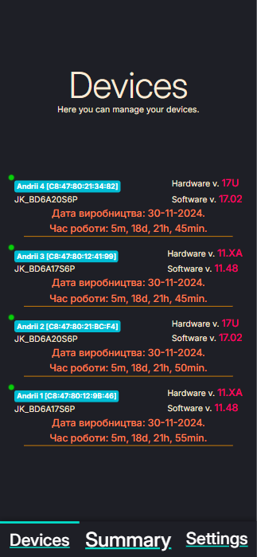
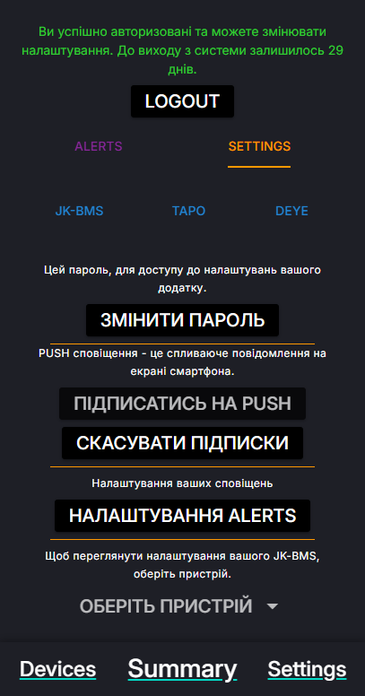

# BMS Monitor [BLE]
## Battery Management System JK-BMS control via Bluetooth low energy

<p align="center">
  
  
  
</p>

## Supported devices
#### All JK-BMS models with software version >=6.0 are using the implemented protocol and should be supported.
* JK_BD6A20S6P, hw 17U, sw 17.02
* JK_BD6A17S6P, hw 11.XA, sw 11.48

## First steeps:
### Clone project:
```bash
git clone https://github.com/RondaYummy/bms-monitor-ble.git
```
1. Install Node.
2. Install Yarn.
3. Install Docker-compose.
4. Setup Nginx and SSL ( https://github.com/RondaYummy/bms-monitor-ble/blob/main/docs/nginx.md )
5. To access from outside the local network, you need to get a static IP address.

## Make sure that the systemctl service is running:
```bash
sudo systemctl start bluetooth
sudo systemctl enable bluetooth
```

## Build Docker:
```bash
yarn build
```

## To copy static resources after a manual build:
```bash
yarn static
```

## [PROD]
```bash
yarn prod
```

## [DEV] 
```bash
yarn dev
```

### [AUTO] Deploy via PM2
```bash
chmod +x deploy.sh
npm install pm2 -g
pm2 start ecosystem.config.js
```
### Clear Database
```bash
docker ps
docker exec -it bms-monitor-ble-python-app-1 bash
rm /app/data/*.db
exit
docker compose restart
```

## Motivation
The official app left me dissatisfied due to its lack of essential features. It doesn't provide critical notifications, such as alerts in Telegram for a low battery level, missing charging, or potential issues with the BMS itself. Monitoring these parameters while standing next to the BMS with my phone felt inefficient and inconvenient. I envisioned a solution where I could access all this data and functionality from anywhere in the world, without being tethered to a specific location.

Inspired by this need, I decided to create my own project using Python and develop a web application that integrates all these features in one place. Unlike the official app, my application includes real-time notifications, remote accessibility, and, importantly, data visualization through detailed charts—something the official app also lacks. This project is a step toward simplifying BMS monitoring and ensuring a seamless user experience, no matter where I am.
